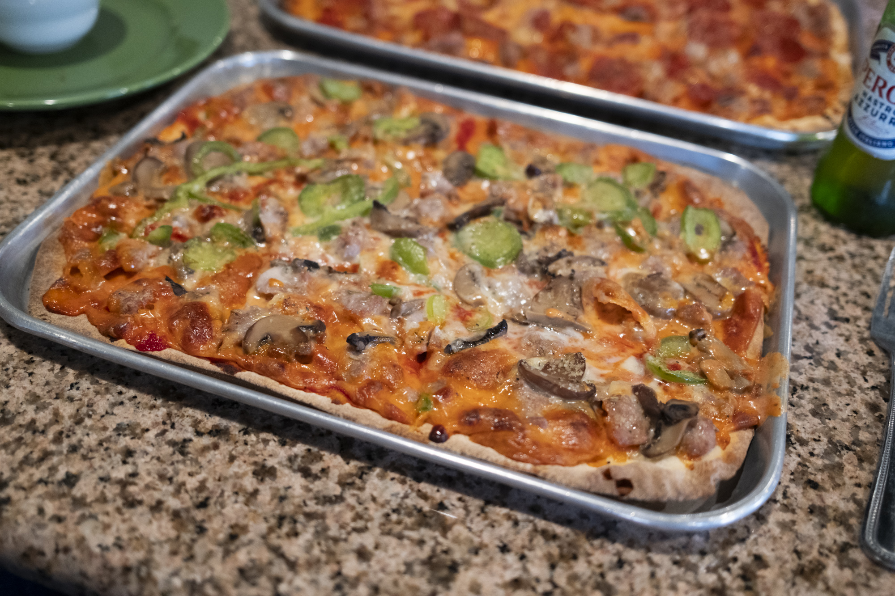

Faraci Pizza is one of the original Pizza spots in St. Louis. It began in Ferguson, Missouri in 1968, and moved to Ellisville in West County in the '90s. Due to its original location, it has that "North side" St. Louis-style pizza vibe. The pizza is rectangular, and the crust is a bit more thick and stable than some other spots, while still being a crispy cracker-crust.

At Faraci, they make the meatballs and sausage from scratch, and use sliced Provel instead of shredded cheese or a blend.

Faraci is very much a favorite neighborhood joint for the surrounding area, and it can get busy during holidays (I've seen them just disconnect the phone due to too many callers).
