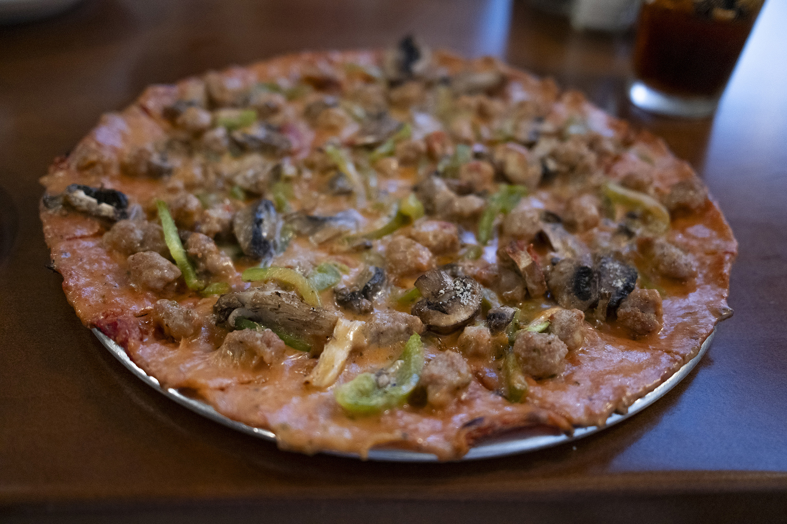
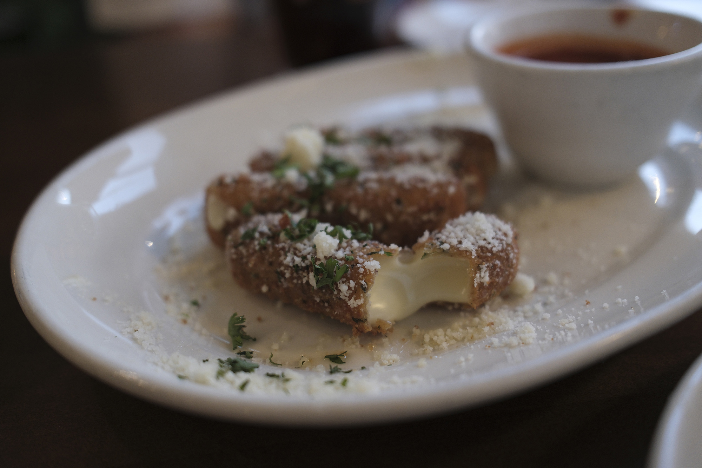
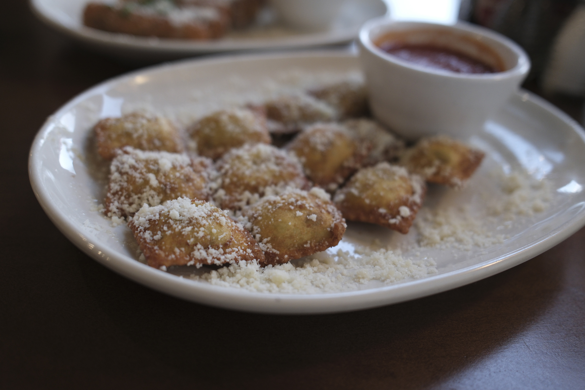
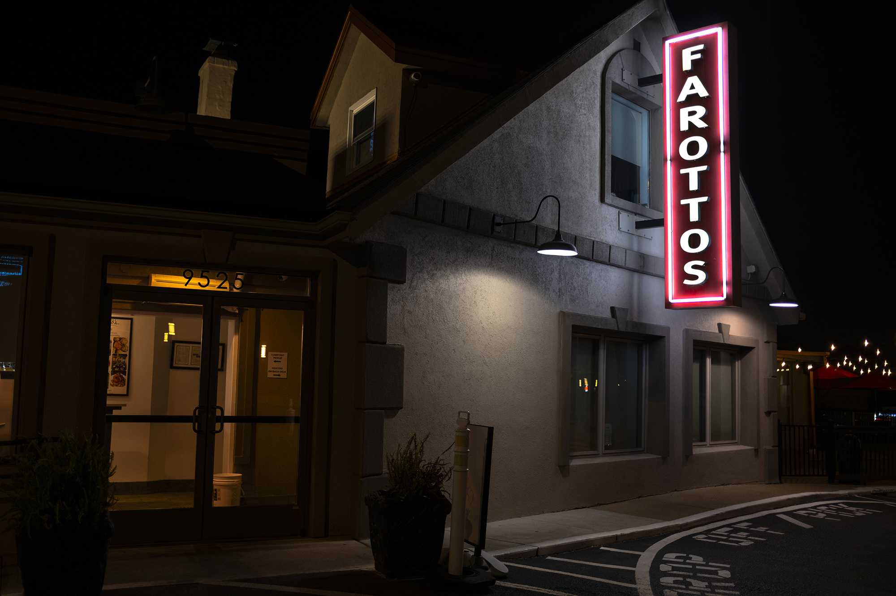
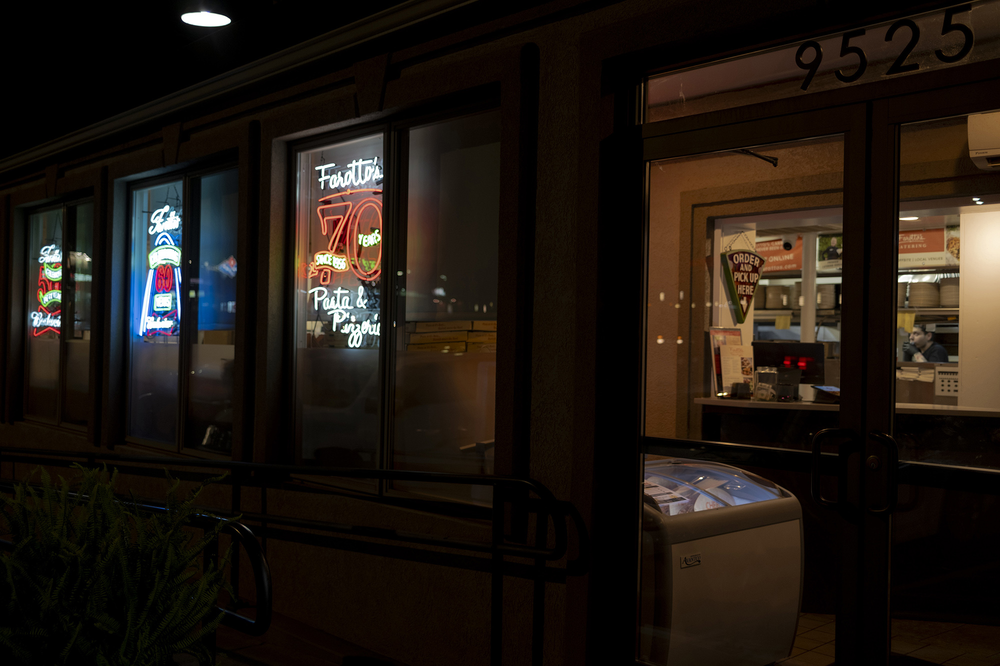
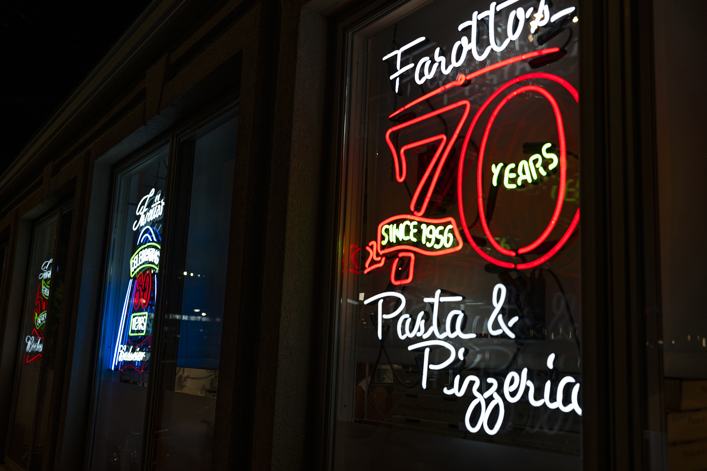

Farotto's is a family-owned restaurant that has been making pizzas since 1956, making it one of the oldest ones as far as I can tell (Imo's began in 1964). It's my top-rated spot for St. Louis-style pizza - their pizza has an extra-extra-thin crust and has a buttery and flaky aspect to it that I haven't experienced at any other pizza place. The sauce is slightly sweet but balanced, and blends well with the melted Provel.

Everything here is good - the toasted ravioli, the pizza, the pasta, the sandwiches. The STL sticks are their version of provel bites and it's a standout item for me.

Farotto's is also a great place to take a group, and it's been one of my preferred restaurants to bring out-of-town guests. Their location in Rock Hill has an event space below, and a big open raised patio/restaurant on the upper level.

