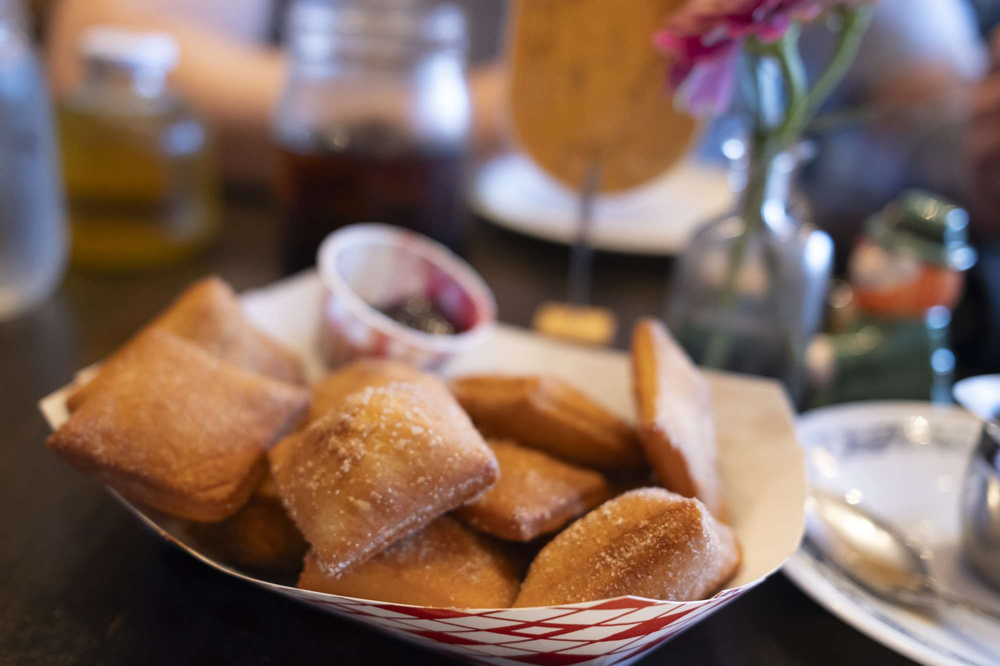
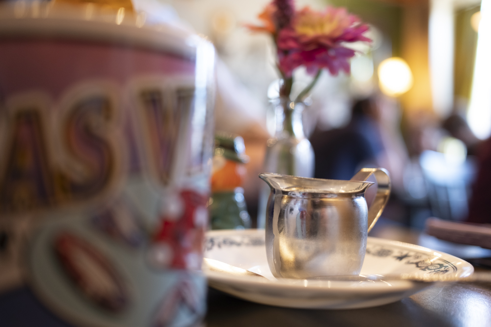
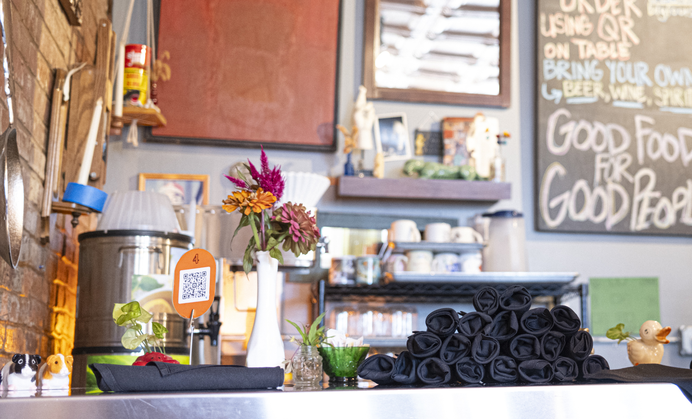
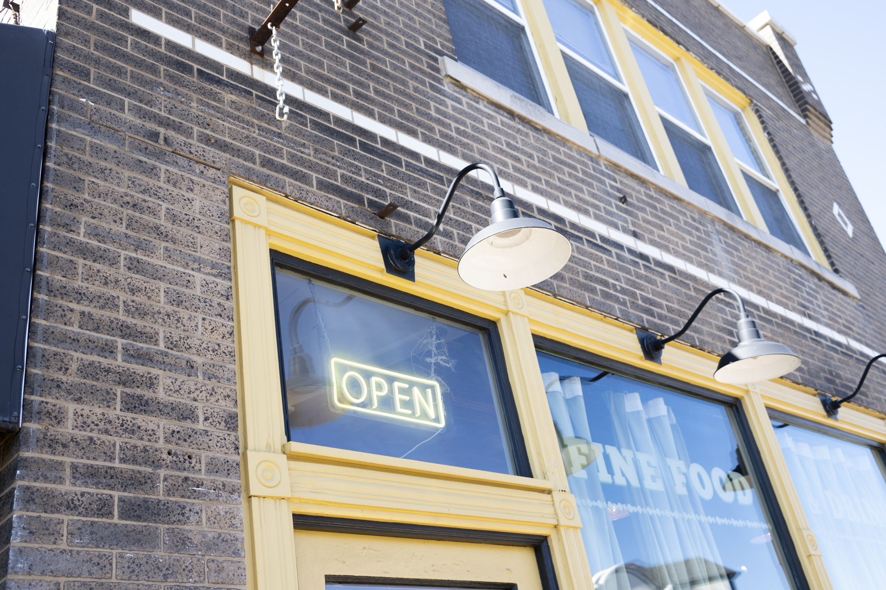

On the northwest side of the Tower Grove South community, there's a strip of restaurants, cafes and businesses along Morganford Rd. One of these is Grand Pied, which is French for "Bigfoot".

I was looking for a good breakfast and I had heard about Grand Pied and their famous pancakes, so I went to go check it out. If anything, the pancakes were undersold, as after the first bite I was sure they were easily the best pancakes I've ever had in my life. Generally, I'm not into pancakes but these were crispy on the outside and perfectly fluffy on the inside. They come with (real) Maple syryp, blackberry jam, homemade whipped cream and butter.

I ordered the "kid's pancakes" to get all the toppings on the side, as I wanted to keep it as crisp as possible and play around with the portions of toppings. All of them were very high quality. (I think calling the exact same dish "kid's pancakes" and charging more for them is a weirdly passive-aggressive way to try to get people not to order toppings on the side, but whatever).

We also got beignets, which were pretty good but not the softest, lightest ones I've ever had, and not the main attraction here. If you're going to get fried dough at Grand Pied, make it the pancakes.

The coffee and cold brew were both really good. I tend to not like coffee from more upscale brunch spots as it tends to be very acidic, but this coffee was from Dubuque and was well-rounded. My only complaint about my entire stay at Grand Pied was that the coffee was "bottomless" but no one ever came around to refill it or check on us during our stay, as it's a QR-code based ordering system.

The ambience of the restaurant had a lot of character with the mural on the wall and various paintings and decorations. The coffee was served in a mug which was a nice touch, and the flowers added a lot of brightness to the room. There was also a patio outside with a lot of greenery which added to the vibe.

I'd consider Grand Pied to be an absolute must-try, especially for anyone who is a fan of pancakes. I'll be going back to try some of the other food.
