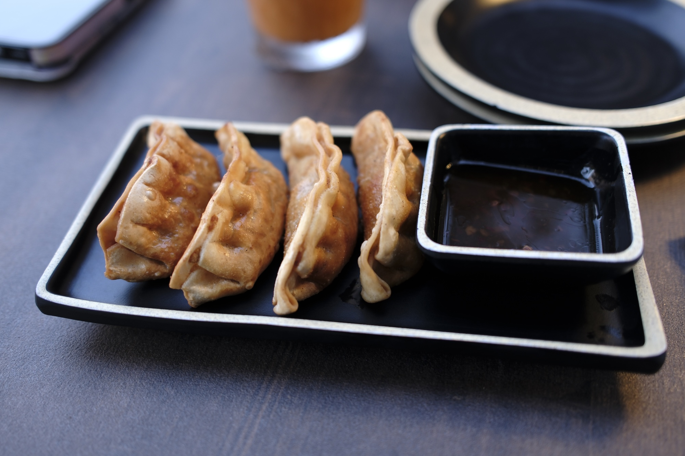
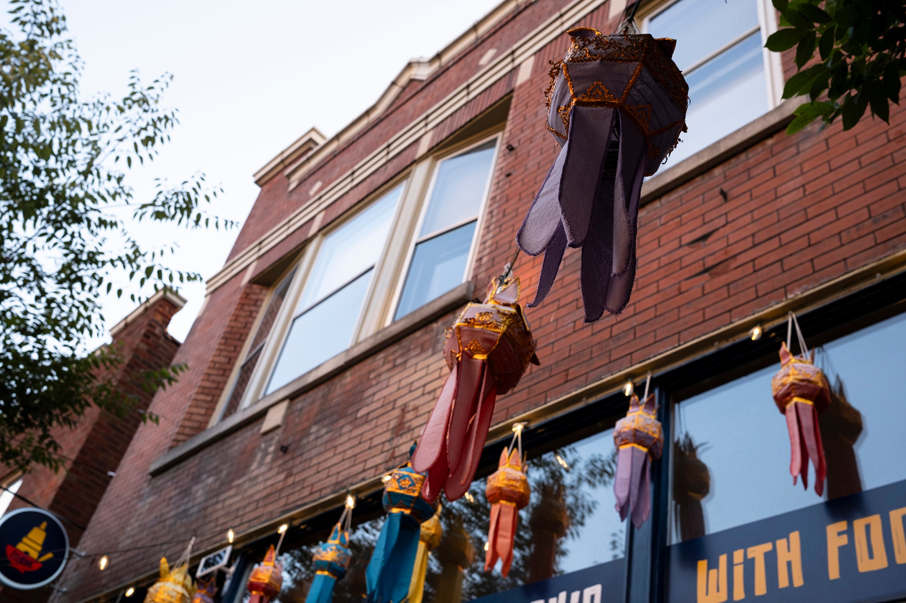

Tucked into a street along Shaw you'll find Tee Rak Thai, an authentic regional Thai restaurant. "Tee Rak" means "My Love" in Thai, and you can definitely feel the love that goes into this homemade cuisine.

I tried Moo Ping, which are BBQ Pork Skewers, and potstickers, along with one of my favorite beverages, Thai Tea. The tea was good and the potstickers were very crispy.

For the entrees, I tried Pad Kee Mao (drunken noodles) and Pad See Ew, two common Thai classics. Both were great, with proper thick noodles and flavor infued all throughout. I got it with crispy pork belly which was the special of the day; if I ordered it again, I would probably try chicken or beef, because the crispy pork belly was so rich, but it was tasty.

I really liked the spice level (I chose 2 out of 4). Usually it's not spicy enough for me at that level and this had a very pleasant level of spice.

The building is also a classic St. Louis red brick (as is most of Shaw) with some nice decor.

