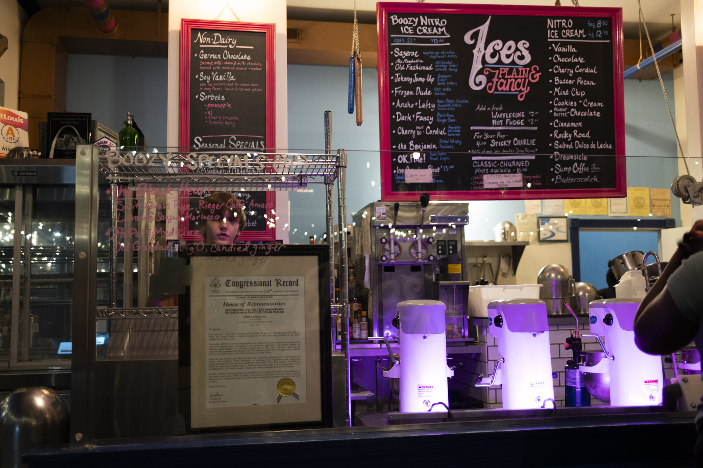

Shaw is a popular, centrally located neighborhood in St. Louis that is highly residential with a few restaurants, bars, and cafes interspersed. There's Ice's Plain & Fancy, a Nitro ice cream parlor, and Sasha's on Shaw, a wine and cheese bar, both of which give the neighborhood an upscale, family friendly feel.

