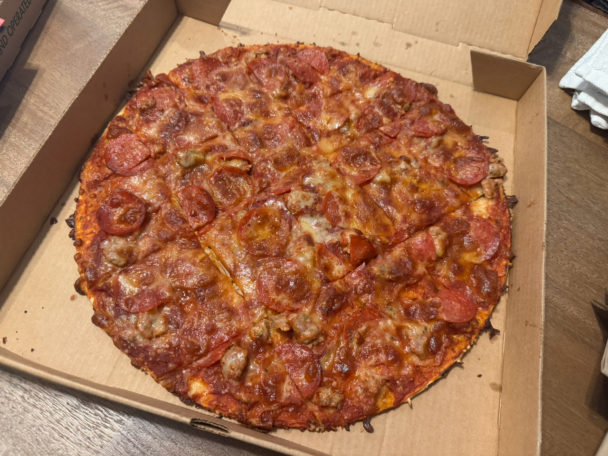

Most cities are lucky to have one local food speciality they can lay claim to, but St. Louis has an abundance of them. I've been interested to discover the food items that either originated in St. Louis or can only be found here.

So here's what I've discovered so far:

### St. Louis-style pizza

A pizza style that is the standard all across the St. Louis region, consisting of a cracker-thin crust, a sweet, thick tomato sauce, and gooey Provel cheese.

See [[st-louis-style-pizza|St. Louis-style Pizza]] for the full writeup.

My personal favorites for St. Louis-style pizza are [[farottos|Farotto's]], [[faraci|Faraci's]], and Pirrone's.

### Provel cheese

The cheese of choice in St. Louis, Provel is an option in almost every pizza place and sandwich shop around the city. It's a processed cheese product made of cheddar, provolone, and Swiss cheese, all mixed together with a hint of liquid smoke. It's the ingredient that makes St. Louis-style pizza controversial, with its goopy texture and smoky, funky flavor.

Although it's notable for its low melting point and unique texture it adds to pizza, you'll also find it liberally applied to mouse house salads in Italian restaurants across the city.

### St. Louis salad

I don't think you'll find this on any other list of local St. Louis cuisine, but I can tell you that the house salad served in many restaurants in STL is unique to the region. The lettuce, tomato, and onion are standard salad ingredients, but the Italian dressing is sweet, almost candy like, and the salad is liberally covered in Provel cheese. Some places have so much Provel on top of the salad that you can hardly see a piece of lettuce poking out.

I do enjoy this salad, but I don't feel very healthy after eating it.

## BBQ & Meats

There are two things to discuss here - St. Louis-style BBQ, and St. Louis cut ribs.

### Ribs

There's a popular cut of ribs called a "St. Louis cut", which is a spare rib with the ends neatly trimmed, resulting in a rectangular shape. This allows for even cooking, as you don't have one end that is significantly wider than the other. Surprisingly, most BBQ spots around here don't tend to use this cut.

It's not exactly a style of regional food, but it's worth mentioning.

### BBQ

BBQ in St. Louis is another contentious topic, with many arguing about what the style is and if it exists at all. Some say St. Louis-style is a mix between Kansas City BBQ and Memphis BBQ.

Here's what I've observed: I've been to around a dozen BBQ spots in St. Louis so far, and I can say pork is king here. Pappy's is the most famous for their ribs, and it's well deserved. You'll see pork steak on the menu at Beast BBQ, and most backyard BBQs. I would recommend against getting brisket, particularly if you're a fan of Texas brisket, as the style is not really found here. (O'B'Que's in Chesterfield is the closest I've found.)

I've heard it said that St. Louisans consume the most amount of BBQ sauce per capita, which tracks with the BBQ style. Ribs, pork steaks, and even backyard grilled hot dogs are slathered in sweet BBQ sauce. Pappy's makes a Sweet Jane BBQ, which goes great on pulled pork or smoked chicken, and Maull's is a classic BBQ sauce from the region. I'm partial to [Freddie Lee's Ghetto sauce](https://freddieleesgourmetsauces.com/home-test/).

I have also found that the smoked wings are slept on - they're crisp and juicy and have been my favorite thing on the menu at several spots. Some places also have their own specialties, like the smoked salami at Adam's Smokehouse.

As a lover of spicy vinegar-based BBQ sauce and wood-smoked savory meats, St. Louis-style is not my preferred style of BBQ, but if you stick to ribs and wings you'll have a good time. It's exciting that a BBQ scene exists here, and I'm looking forward to continuing to try more.

#### Where I've been so far

- [[ob-ques|O'B'Que's]]
- [[the-stellar-hog|The Stellar Hog]]
- [[pappys|Pappy's Smokehouse]]
- Dalie's Smokehouse
- Beast Craft BBQ Co.
- Adam's Smokehouse
- Salt & Smoke BBQ
- Sugarfire Smokehouse
- Bandana's Bar-B-Q
- Fourth City BBQ
- The Shaved Duck (rip)

### Pork steak

Pork steak is a cut of meat derived from sliced pork butt, usually with the bone in. Often they're grilled over high heat then slathered in BBQ sauce and braised until tender. Although most BBQ spots in St. Louis won't have it on the menu, pork steak is known to all. It's one of the primary meats of choice for any backyard BBQ.

## Bar & Diner Food

### Toasted ravioli

You'd be hard pressed to find a bar or restaurant in the entire St. Louis metro area that doesn't serve toasted ravioli, also known as "t-ravs". They're the default appetizer of choice throughout the region - little beef-filled ravioli that are deep fried, sprinkled with parmesan, and served with marinara sauce for dipping.

I was a bit thrown off by toasted ravioli when I first moved here, as I always expect ravioli to be filled with ricotta cheese, not a smooth beef paste, but I got used to it. I tend to prefer the ones that are filled with something else, like the buffalo chicken t-travs from [[stacked-stl|Stacked]], or the burnt end t-ravs from Salt & Smoke, or even the spinach artichoke t-ravs at McGurk's.

The best t-ravs I've had so far are made at [[buds-pizza-and-beer|Bud's Pizza and Beer]].

### Trashed wings

Trashed wings are a double-fried style of bar wings. First the wings are fried, then tossed in sauce and fried again, caramelizing the sauce and making them twice as crisp.

### Slinger

A slinger is a greasy spoon diner meal that consists of eggs, hash browns and a hamburger patty, covered in chili and cheese. I haven't been drunk enough to ever need this meal, but I'm sure I'll be exposed to it eventually.

### Brain sandwich

Yeah...St. Louis is one of the only places in the U.S. you can still get a brain sandwich. You can get it at Schottzie's Bar & Grill, deep-fried and served on marble rye with pickles and mustard.

## Pizza, etc.

## Chinese

### St. Louis fried rice

St. Louis, particularly the north side of St. Louis city, is home to many old style chop suey shops serving up a particular variation of fried rice that is much darker than your average fried rice. I'm not sure if it's just extra soy sauce or any other particular ingredients that are used.

I was interested in this topic and found the article [In St. Louis 'Chinamen' is Black Culture\*](https://medium.com/@relativelywoke/in-st-louis-chinamen-is-black-culture-797413e9ed1) which is an interesting writeup on a topic I know nothing about, and [From Far East to Midwest: chop suey's last stand](https://www.stlpr.org/2012-02-07/from-far-east-to-midwest-chop-sueys-last-stand#stream/0).

<small>\* I'm just linking to the article, I don't condone the use of this word</small>

### St. Paul sandwich

I have yet to try this delicacy, but chop suey shops all around St. Louis have it on the menu. It consists of a fried egg foo young patty between two slices of white bread, with lettuce and mayonnaise. It's an interesting historical fusion of flavors, and I'm happy to see it lives on in the present day.

### Hot Braised Chicken

I haven't been able to find out too much about this dish and what makes it special, but you'll see it on many restaurants all over the St. Louis region, and basically nowhere else. It seems to me kind of similar to sweet and sour chicken style, but tossed in General Tso-style sauce.

## Desserts

### Gooey butter cake

The signature dessert of St. Louis, gooey butter cake is a dense, sticky, rich cake with a crisp, flaky top layer. It almost has the consistency of a light brownie, or a lemon bar without any lemon. You'll find them in many cafes alongside the croissants and muffins.

The consistency can vary a lot from recipe to recipe, and I like it when there are contrasting textures between the rich, gooey center and the flaky crust, like a pie. Sometimes the whole thing has one unified texture, and it loses its appeal for me.

### Frozen custard/concrete

Ted Drewes Frozen Custard is the oldest frozen custard stand still in operation, founded in 1929. They began the concept of the concrete, a frozen custard with mix-ins, which was later co-opted by Dairy Queen, which they called blizzards.

A popular St. Louis tradition is to get Ted Drewes during Christmastime then walk down the streets of Candy Cane Lane, a neighborhood where every house is all done up with Christmas lights.

## Snacks

### Red Hot Riplets

Red Hot Riplets are a brand of ridged chips with a unique sweet BBQ and cayenne flavor. In addition to just being a chip, you'll find Red Hot Riplet flavor and spice blend used often. Imo's tosses their fried wings in Red Hot Riplet seasoning as a dry rub. I'm generally not a fan of BBQ chips, but I do enjoy the Riplet rub on wings.

### Tzitzel bagel

A cornmeal-coated bagel, which originated in Pratzel's Bakery in the early 1900s. You can still find this at Lefty's Bagels and Baked & Boiled. You can read more about tzitzel at [The tzitzel bagel — a crunchy St. Louis classic with a century-old story](https://stljewishlight.org/news/news-local/tzitzel-bagel-a-st-louis-tradition/).

## Closing Thoughts

### Flavor profile

One thing I've noticed across the board is that the main flavor profile across the board in St. Louis is "sweet". The signature BBQ sauce is sweet, the pizza sauce is sweet, the salad dressing is sweet, and the desserts are doubly sweet. You won't really find vinegary, sour, or bitter flavors.

### Other things of note

St. Louis is home to the [largest Bosnian population in the U.S.](https://www.bbc.com/travel/article/20220117-st-louis-the-us-city-transformed-by-heartbreak) and as a result, there are a fair amount of Bosnian and Balkan restaurants - notably Balkan Treat Box and a strip of restaurants in the [[bevo-mill|Bevo Mill]] neighborhood.
