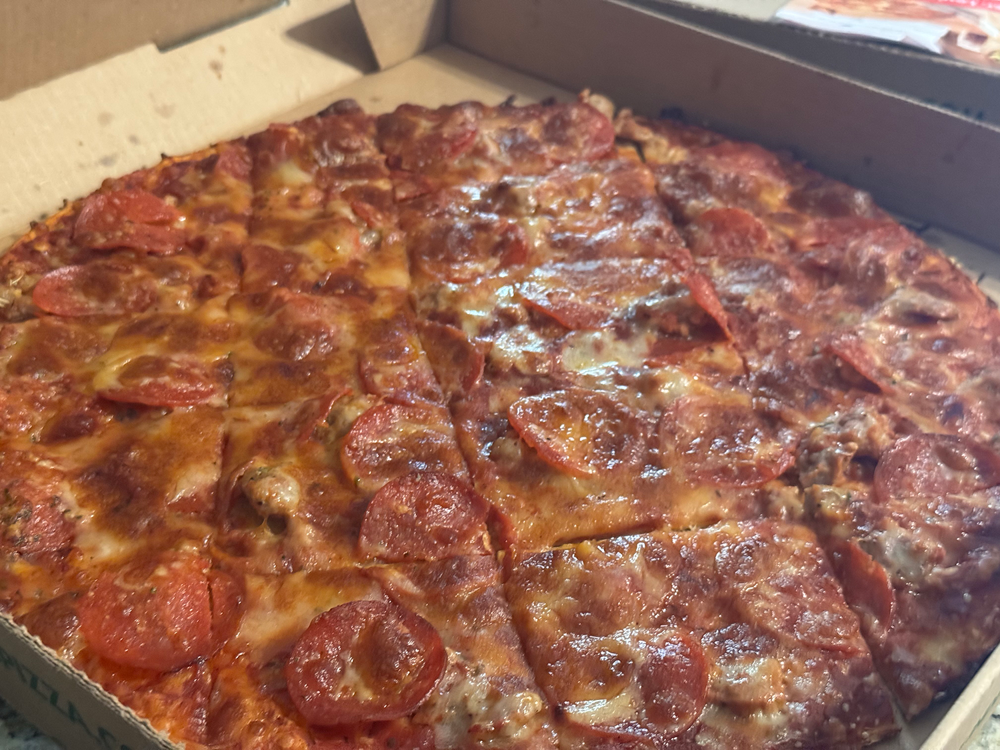
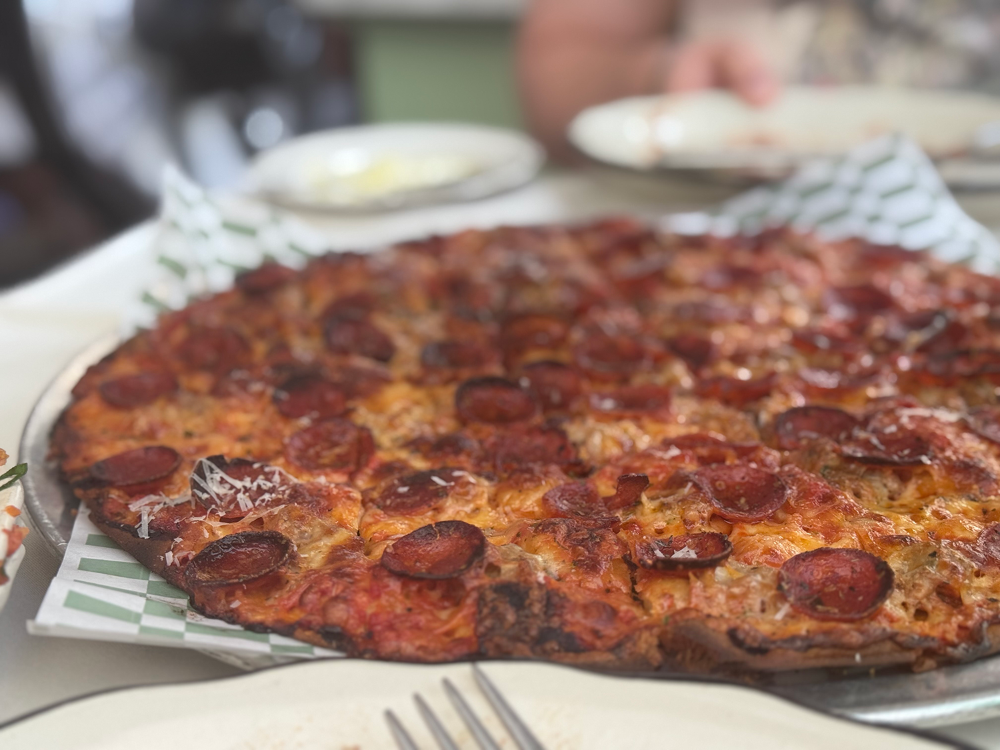
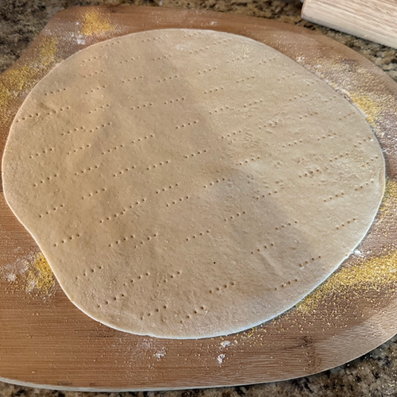
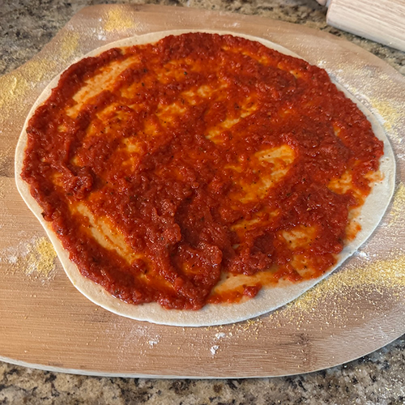
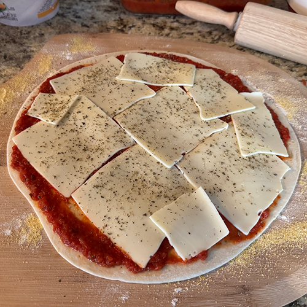
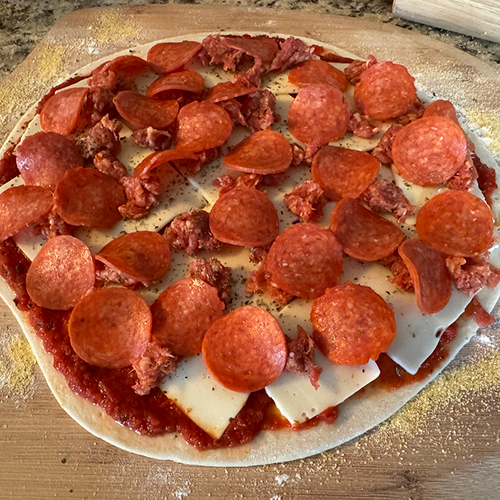
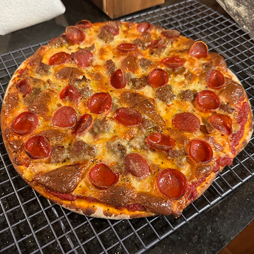
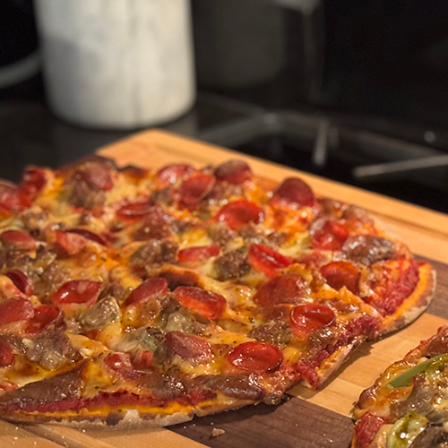
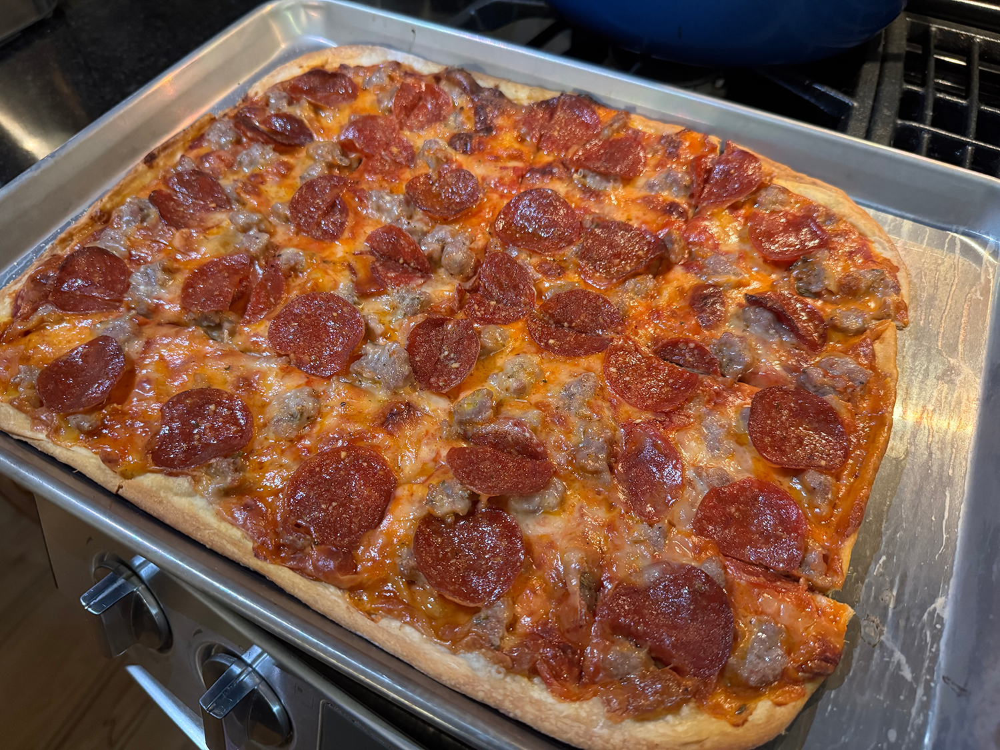
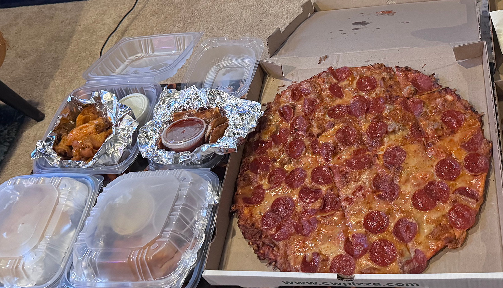

<figure class="figure left">

<figcaption>St. Louis-style pizza from Imo's</figcaption>
</figure>

St. Louis-style pizza is a regional variation of pizza that is ubiquitous across the entire St. Louis metro area. For many, the pizza style is synonymous with Imo's, a local chain that has locations in all the far reaches of Missouri and southern Illinois, but many local pizza places all around St. Louis make their own variation of this unique pizza style.

Although divisive, St. Louis-style pizza has fervent defenders (I reference two independent articles in this post that start with "In Defense of..."). I personally had never heard of St. Louis-style pizza until I moved here, and was intrigued to discover hundreds of restaurants and bars serving them up (Imo's alone has over 100!).

My first experiences with STL-style pizza were not the best, and initially I was the classic dismissive transplant, but over time I've acquired a taste and appreciation for this regional specialty. For every birthday, graduation, and celebration, St. Louis-style pizza is there for us, and I can see why so many people feel so deeply protective of it.

## What defines a STL-style pizza?

### Cheese

You can't talk about St. Louis-style pizza without talking about Provel - it's the most unique and controversial aspect of the pizza. Provel is made up of cheddar, Swiss, and provolone cheese with a hint of liquid smoke, and it's processed and emulsified like American cheese. I would say it tastes kind of similar to a smoked gouda with the consistency of American cheese (those who did not grow up with it often describe it as plasticy). Provel was developed in the '40s as an answer to the cheese pull issue, to ensure slices could be cut and removed easily. With Provel, you can't end up accidentally pulling off all the cheese on a slice with a single bite, so I can understand the rationale.

Pizza generally consists of three ingredients (crust, sauce, and cheese) and most styles of pizza default to mozzarella. Provel being so different in both flavor and consistency from what anyone outside of the region expects is, in my opinion, what throws people off so much when they try it for the first time.

I've had dozens of STL-style pizzas at this point (see [my ratings](#my-ratings) below) so I know what to expect, but I will admit the first time I was genuinely confused about what I was experiencing and it has been an acquired taste. If you grew up with Provel, however, that would be a different story, and you'd already be used to the taste and have years of fond memories associated with it.

> But the truth is that my love for Provel is intense, almost mystical, and I’ve finally started taking it seriously.

<cite>Adam Rothbarth, [In Defense of a St. Louis Favorite, Provel Cheese](https://www.foodandwine.com/provel-cheese-is-a-st-louis-favorite-8717484)</cite>

### Crust

One thing all St. Louis-style pizzas have in common is the crust is very thin. Some describe it as unleavened, but usually the dough is made with a light amount of yeast and low hydration, resulting in that cracker-thin crisp. In Kenji López-Alt's famous dissertation, he describes it as a pizza nacho, which is definitely an interesting and not entirely inaccurate description.

> And yet, ever since tasting it for the first time, I haven't been able to stop thinking about it. And I've finally figured out why I love it so much. St. Louis-style pizza is not pizza. It's a big, pizza-flavored nacho.

<cite>J. Kenji López-Alt, [In Defense of St. Louis-Style Pizza](https://www.yahoo.com/lifestyle/defense-st-louis-style-pizza-120000289.html)</cite>

This article was in fact the first step for me towards seeing this pizza from another angle.

### Sauce

The sauce on a St. Louis-style pizza is also unique. In general, it's significantly sweeter and thicker than your standard pizza sauce. Some recipes, like Imo's, even use straight tomato paste as opposed to whole tomatoes. The sweetness can vary, with some places almost tasting like a tomato jam to me.

### Cut

St. Louis-style pizza, like other Midwest styles of pizza, is cut into squares, resulting in some pieces having an edge, some being all middle-piece, and some being extra-crispy corner pieces. I've never liked the corner pieces much, but they seem to be everyone's favorite. Cutting a STL-style pizza into triangles would just feel wrong.

### Toppings

You'll see all the standard toppings on a STL-style. It's important that the sausage should be bulk sausage placed on the pizza raw, not pre-cooked sausage bits like you'll see at national chain pizza spots. I don't know why, but I've also seen a lot of shrimp as a topping here which I've never seen anywhere else (not a fan), and if you get bacon on your pizza, it's in the form of whole strips as opposed to bacon bits (am a fan).

## Tavern-style controversy

<figure class="figure right">

<figcaption>Chicago-style pizza from Pizz'amici</figcaption>
</figure>

Not so long ago, the term "tavern style" came into popularity, generally referring to the thin-crust style of pizza commonly served in bars and taverns across the Chicagoland area. This was seen as unfair in the eyes of many St. Louisans, as Chicago already has a regional variation of pizza in deep dish, and St. Louisans have been eating thin pizzas cut into squares for decades.

There are many regions of the midwest that all lay claim to the thin pizza cut into squares. Milwaukee and Chicago claim to have invented the concept. Columbus, Ohio has a version with an extreme amount of toppings layered edge-to-edge. Tombstone frozen pizzas was started in Wisconsin in the early '60s, clearly a style of pizza that fits the "tavern-style" description.

Personally, I choose to think of it all as Midwestern-style pizza with regional variations. Only St. Louis does Provel cheese, and every single place that I've ever seen calling their pizza St. Louis-style has Provel on it or a Provel blend, so I would consider that the most essential difference. I also find the crust to be much thinner and more cracker-like than all the Chicago thin-crust pizzas I've eaten throughout my life.

I think St. Louis has their own thing going here and it's pretty cool that something so unique and special can be found all over this region and almost nowhere else.

## Regional sub-variations

Even within St. Louis-style pizza, there are seemingly sub-variations.

### North

I've noticed pizzas like Pirrone's, Faraci's, and Angelo's, which are found on the north side of the St. Louis area, are all similar in a specific way. They're rectangular, have a slightly thicker, yeastier crust, and the cheese and sauce blend together to make an orange hue.

### South

Meanwhile, Failoni's and the original Imo's are based on the south side of the St. Louis area, and the pizza are round, with a flatter, thinner crust, and the cheese is clearly a separate layer on top of the sauce.

This might not be entirely accurate, and most places do the round pizza, but I think it's interesting to note.

## Making a pizza from scratch

Loosely based on a recipe posted on reddit by [HouseofProvel](https://www.reddit.com/user/HouseofProvel/), I made a St. Louis-style pizza from scratch with a three-day ferment on the crust. I opted to use slices of Provel as opposed to shredded as it's the way [Faraci's does it](https://www.faracispizza.com/ourpizza).

     

I thought it came out pretty good, though I'd make some changes if I do it again. I made the crust with butter because I like butter, but shortening would be better for a crispier, lighter crust. I'd add slightly more sweetness to the sauce, and I'd use a little more yeast in the crust.

## My ratings

<figure class="figure right">

<figcaption>Pepperoni and sausage from Faraci Pizza</figcaption>
</figure>

Here's a subjective rated list of the places I've tried. I would say the top three are all vying for first place at the moment.

1. [[farottos|Farotto's]]: A pizza with extra-extra-thin buttery, flaky crust, a slightly sweet sauce, and quality ingredients. Just don't get Jimmy's favorite (shrimp and bacon...why??). This is my place of choice to take out of town visitors, as the rest of the food is also great.
1. [[bonos-pizzeria|Bono's Pizzeria]]: Crispy, thin, tavern-esque pizza with light sauce and Provel.
1. **Pirrone's Pizzeria**: It's a bit out of the way from the city itself, but worth a visit. Pirrone's makes a rectangular pizza with a crispy, buttery crust, where the cheese and sauce blend to make an orange mix.
1. **Faraci Pizza**: Similar to Pirrone's in size and shape, with a more bready, yeasty crust.
1. **Salvage Yard**: A solid choice for a standard STL-style.
1. **Imo's Pizza**: By far the most famous and infamous pizza in town, Imo's is THE St. Louis pizza chain and the only STL-style many people have ever tried. Imo's has a mass-produced flavor to it, unlike the home-style vibes of a lot of other spots. The quality also varies a lot from location to location. It can be okay, but not the best representation of pizza in the area, in my opinion. Sometimes I do specifically crave an Imo's pizza, though.
1. [[failonis|Failoni's]]: A brick-oven pizza with a very crisp cracker-like crust. (I believe this also counts as Uncle Leo's pizza, as they're under the same ownership, but I haven't tried it to confirm.)
1. **Nick & Elena's**: I know people love this place, and the old-school vibes are top-notch, but I didn't personally like the pizza (specifically the sauce was way too sweet for me).
1. **Cecil Whittaker's**: This was one of my least favorite St. Louis-style pizzas I've tried. It's like an Imo's clone with lower quality ingredients.
1. **Elicia's Pizza**: The first St. Louis-style pizza I ever tried was from Elicia's. It was completely burnt and inedible, and unfortunately they're no longer in business for me to know whether or not that was a fluke.

So I've tried a variety of fan favorites around the city, but I'm always open to new suggestions. A few I have yet to try are Affton Pizza Company, Angelo's, Kevin's Place, and plenty more.

## What do I think?

<figure class="figure left">

<figcaption>Delivery from Cecil Whittaker's</figcaption>
</figure>

I like pizza. I think (almost) all pizza is good. I love trying new things, especially regional food that you can't get everywhere. My personal favorite styles of pizza are thick, bready styles, like Sicilian, Detroit-style and pan pizza. I'm also a fan of fresh, high-quality ingredients, like the fresh basil and mozzarella found on a Neapolitan margherita pizza.

So personally, St. Louis-style or even Chicago thin-crust are just never going to be on the top of my list, because I'm here for the dough. Nonetheless, I still like it and have acquired the taste since moving here, and I'm still excited to try all the spots and decide which one is my favorite. Sometimes I specifically crave a St. Louis-style pizza, and I'd miss it if I no longer lived here.

But most of my favorite pizzas around the city are not specifically St. Louis-style.

## Other pizza in St. Louis

Although St. Louis-style pizza is obviously the most common style to be found in the region, there's also New York-style at [[la-pizza|La Pizza]], Detroit style at [[nicky-slices|Nicky Slices]], Chicago thin-crust at [[jj-twigs-pizza-and-pub|J.J. Twig's]], Neapolitan style at Fordo's Killer Pizza, standard pizza at [[buds-pizza-and-beer|Bud's Pizza and Beer]], and many more found all around the city. I have yet to try a Sicilian-style or deep dish in St. Louis, but I'm looking forward to continuing my pizza journey.
